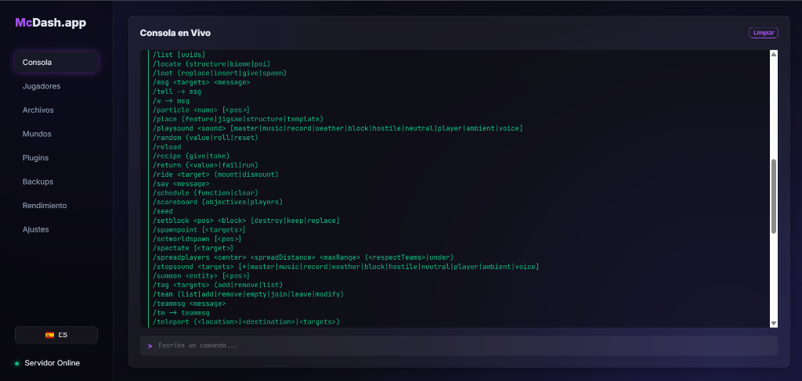
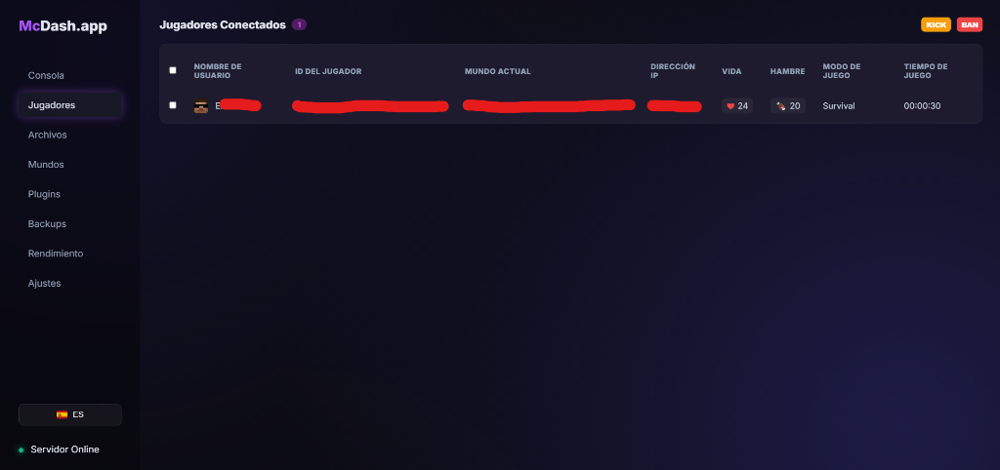
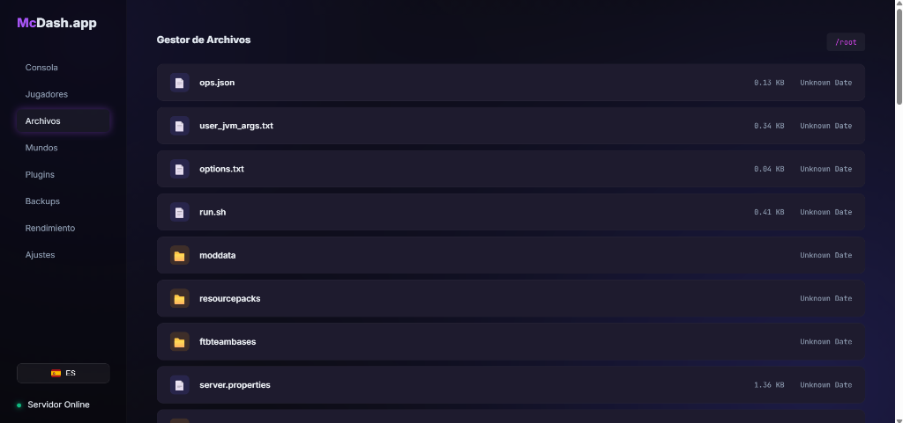
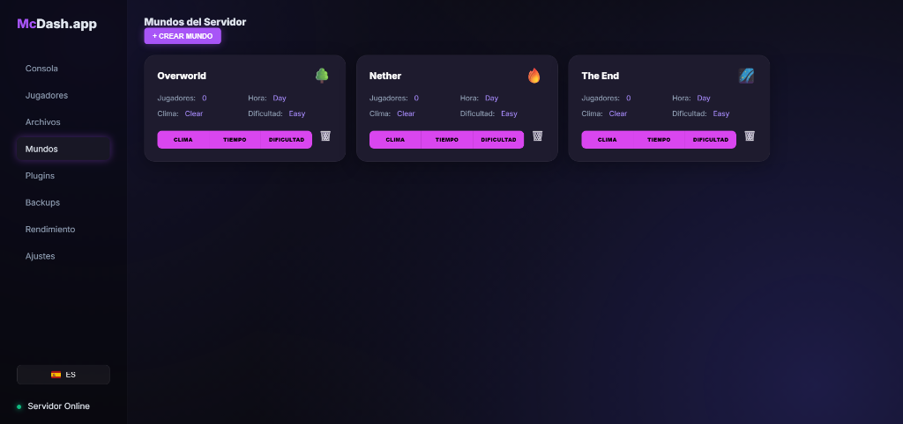
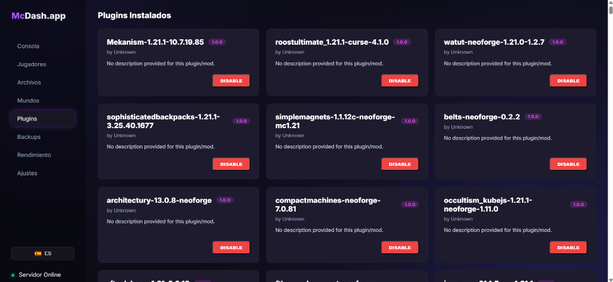

# McDash.app 🚀
### Premium Standalone Minecraft Dashboard v1.0

McDash.app is a professional, high-performance administrative dashboard for Minecraft servers. Unlike traditional plugins or mods, McDash.app runs as a **standalone** service, communicating with your server via RCON and real-time log analysis.

## 📸 Preview & Gallery

McDash.app features a stunning, modern interface designed for clarity and efficiency.

<p align="center">
  
  
</p>
<p align="center">
  
  
  
</p>

## 📱 Mobile Ready
The entire dashboard is built with a **Mobile-First** philosophy.
- 🚀 **Fully Responsive:** Every table, chart, and terminal adapts perfectly to smartphones and tablets.
- 📲 **On-the-go Management:** Ban players, check performance, or run console commands directly from your mobile browser while you are away from your PC.
- ⚡ **Optimized Performance:** Lightweight assets ensure a smooth experience even on mobile data.

## ✨ Key Features

- **💻 Live Console:** Real-time terminal with RCON command execution.
- **👥 Player Management:** Monitor health, hunger, dimension, and playtime. Perform actions (Kick, Ban, OP) in bulk.
- **📁 Advanced File Manager:** Upload, download, and manage server files with security traversal protection.
- **📊 Performance Metrics:** High-fidelity charts for CPU, RAM, and Disk usage.
- **📦 Backup System:** Integrated support for FTB Backups 3 or custom backup scripts.
- **🌍 Multi-language:** Support for English, Spanish, French, German, and Portuguese.
- **🔐 Security:** Protected by Basic Auth and Global CSRF Handshake headers.

## 🛠️ Installation & Setup

### Prerequisites
- Java 17 or higher
- Maven
- RCON enabled in your `server.properties`

### 1. Clone the repository
```bash
git clone https://github.com/Erkoke108/McDash.app.git
cd McDash.app
```

### 2. Configure
Edit `config.properties` with your server details:
```properties
# Minecraft Server Path
minecraft.path=../server/
# RCON Config
rcon.host=127.0.0.1
rcon.port=25575
rcon.password=your_secret_password
```

### 3. Build & Run
```bash
chmod +x setup.sh
./setup.sh

# Start with PM2 (Recommended)
pm2 start java --name McDash.app -- -jar target/mcdash-standalone-1.0.jar
```

## 🔒 Security Notice
The dashboard is protected by a mandatory login.
*It is highly recommended to change these in `config.properties` before public deployment.*

---
Developed with ❤️ by [Erkoke](https://github.com/Erkoke108)
